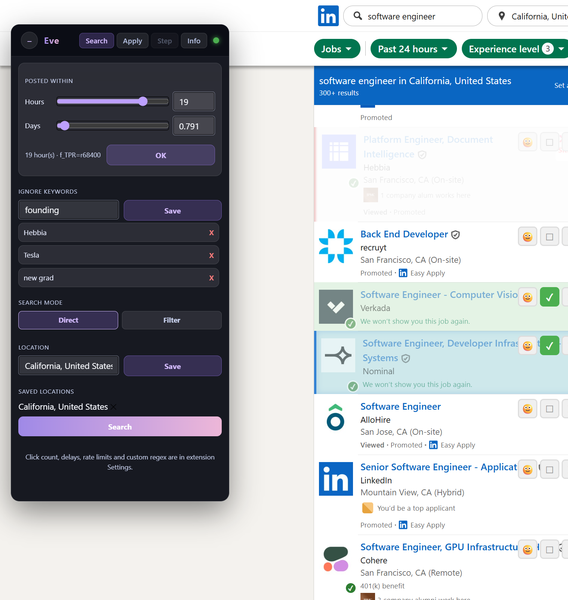
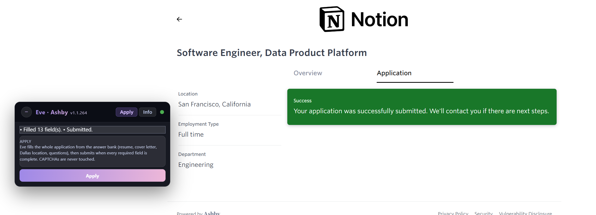

# Eve

A Chrome extension that applies to jobs for you.

Eve sits on the job page you are already looking at, fills the whole application from your own
answer bank, and submits it when — and only when — every required field is genuinely complete. You
start it, walk away, and come back to a list of submitted applications.

> "A ship in harbor is safe, but that is not what ships are built for." — John A. Shedd, *Salt from My Attic* (1928)

---

## What it looks like

**Search and shortlist on LinkedIn** — filter by how recently a job was posted, drop companies and
titles you never want to see, and run the search loop.

**Fill and submit an application** — the panel reports what it filled and what it submitted.

---

## Supported sites

| Site | What Eve does there |
|---|---|
| **LinkedIn** | Search, shortlist, and run Easy Apply end to end |
| **Workday** | Account creation/sign-in, the whole multi-step application, and submit |
| **Greenhouse** | Fill and submit, including forms embedded in a company's own careers page |
| **Ashby** | Fill and submit, including cross-origin embedded forms |
| **Indeed** | The Smart Apply flow, step by step, through to submit |
| **SmartRecruiters** | Fill everything; you review Experience/Education and submit |

Each site is handled by its own independent engine, so a change made for one platform can never
break another. They all draw on the same answer bank.

---

## Main functions

**Search and shortlist (LinkedIn).**
Posted-within slider down to the hour, ignore-keywords for companies and titles you never want to
see, saved locations, and a choice between driving LinkedIn's own filters or searching directly.
Jobs you have already seen or dismissed stay dismissed.

**Fill an application.**
One click fills the entire form: resume and cover letter, identity fields, location, and every
question Eve recognises. Anything it cannot answer is listed by name so you can fill it in or teach
it the answer.

**Submit when complete — never blind.**
Eve submits only after verifying every required control is actually filled. If something is
missing, it holds and tells you exactly what. It never touches a CAPTCHA.

**An answer bank you own.**
Answers are stored as topics matched by pattern, not by exact question text, so one entry answers
the same question however a company words it. You can add your own from the settings page.

**Applied-jobs log.**
Every submission across every platform, in one list, newest first.

**Pacing you control.**
Click counts, delays and rate limits are configurable, so an automated run does not look like a
bot and does not get your account limited.

---

## How it is designed

**One engine per site, no shared runtime.** Every platform's flow is isolated. This is the reason
Eve can support six very different application systems without regressions leaking between them.

**A shared answer bank, matched semantically.** A question is matched by its *shape*, never its
literal wording — a company name, a city, or an example list inside a question is treated as
incidental. When a question offers options, Eve picks by ordered preference over the options that
actually exist, so a single stored answer works whether the site offers Yes/No buttons, a dropdown,
a radio group, or a searchable list.

**Answers are reasoned for you, not string-matched.** Eve chooses the option that best fits your
real situation. It will not claim something untrue — for example, when a form offers "I'm based in
this city" versus "I'm open to relocating", it takes the relocation option.

**It behaves like a person, not a script.** Fields are filled one at a time: click the field, type,
click away, pause. Choices are made one at a time with the same rhythm. Typeahead fields are typed
into *and then a real suggestion is clicked*, because typing alone leaves those fields empty on
submit. Several application platforms only validate on blur, and filling them at machine speed
leaves genuinely-filled fields marked as errors.

**Nothing is assumed to have worked.** An attachment counts only when the page shows the filename;
a selection counts only when the control reports the value; the application is submitted only after
the completeness check passes.

---

## Install

1. `git clone git@github.com:Dark417/2easyapply.git`
2. `cd 2easyapply` (stay on `main`; there is no `master`)
3. Open `chrome://extensions/` and enable **Developer mode**
4. **Load unpacked** → select the `eve` folder
5. Pin Eve to the toolbar

Open a supported job page and the Eve panel appears. The toolbar popup holds the global toggle and
search setup; the settings page holds your profile, saved answers, pacing and the applied-jobs log.

Your data — profile, answers, and the applied-jobs log — stays in Chrome's local extension storage
on your machine.

---

## Repository

- `eve/` — the extension
- `design/` — how each platform's flow works and what has been confirmed live
- `tools/` — answer-bank tests and development helpers
